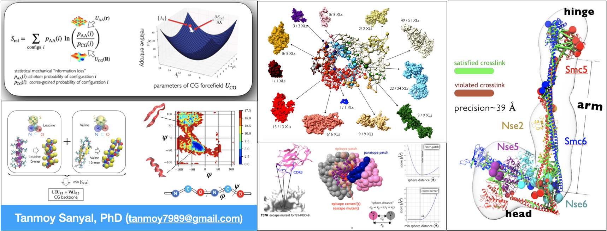

 

I am a computational chemist turned structural biologist turned in-silico protein designer. In a past life, I also dabbled in systems biology (reaction-diffusion models of human respiration) but have scaled down to molecular length-scales since then.

 

- Techniques I use most frequently: Bayesian inference, Markov-Chain-Monte-Carlo. 

- Stuff I've developed:
  - [manybody potential for coarse grained MD simulations](https://docs.lammps.org/pair_local_density.html)
  - [Bayesian network based integration of cell models](https://github.com/tanmoy7989/bayesian_metamodeling_tutorial)
  - [integrative structure of the yeast Smc5/6 complex](https://github.com/integrativemodeling/smc56_nse256)

- Stuff I'm working on right now:
  - Integrative docking of nanobodies on pathogenic targets, based on noisy chemical crosslink and escape mutation.  
  - Stochastic partitioning of protein complexes into multi-chain domains

You can find more details about my research on my [website](https://tanmoy7989.github.io). Feel free to reach out if you want to know more about my research and/or wish to collaborate. 
